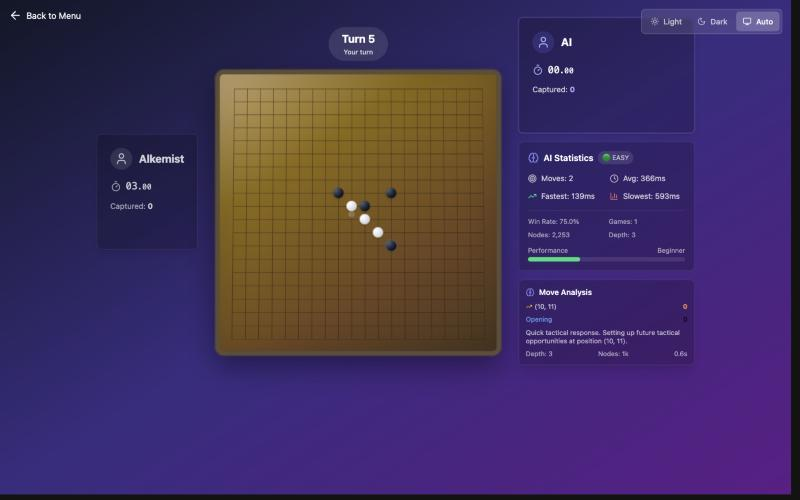
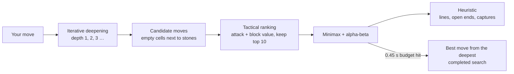

# Gomoku

Five-in-a-row on a 19×19 board against a minimax AI with alpha-beta pruning, served by a Flask API and played in a React + TypeScript UI that shows the AI's reasoning live (search depth, nodes evaluated, thinking time).

**Stack:** Python · NumPy · Flask · React · TypeScript · Vite · Tailwind CSS



## Rules

- Align 5 stones to win, or capture 5 pairs (flank two enemy stones to remove them).
- Moves that create two free threes at once are illegal.
- Player vs AI, or two players on the same screen.

## How the AI plays



- **Time-bounded search.** The engine deepens one ply at a time and stops when its 0.45 s budget runs out, keeping the move from the deepest search that finished. A slow position never stalls the game.
- **Tactical move ordering.** Each candidate is scored by how much it extends the AI's own lines and how much it blocks the opponent's; only the 10 most forcing moves are searched, so wins and must-blocks are always examined first.
- **Heuristic.** Every stone is scored by line length and open ends in four directions; five in a row or five captured pairs is a terminal score. Evaluations are cached per position.

## Performance

Measured over the same opening at each difficulty (`make test`, Apple M-series laptop):

| Difficulty | Max depth | Avg. time per move | Slowest move |
|---|---|---|---|
| Easy | 3 | 0.11 s | 0.20 s |
| Medium | 7 | 0.45 s | 0.45 s |
| Hard | 11 | 0.45 s | 0.45 s |

Every move stays under the subject's 0.5 s average. In that budget the pure-Python search completes depth 4 on medium and hard; going deeper would need a faster evaluator (incremental scoring or a compiled core).

## Run

```bash
make start      # builds the frontend and backend, serves the game on http://localhost:6969
make dev        # API on :6969 and Vite dev server on :5173 with hot reload
make test       # AI checks: time per move and blocking an open line
make help       # all targets
```

Requires Python 3.8+, Node.js 16+ and Make.

## Layout

```
backend/
  server.py              Flask app: API + built frontend
  api/                   game and settings endpoints
  srcs/ai/               minimax, heuristic, AI manager
  srcs/game/             board, captures, rules, game state
  tests/check_ai.py      speed and tactics checks
render/                  React + TypeScript frontend
docs/                    subject and AI write-up
```

Built at 1337 (42 Network).
